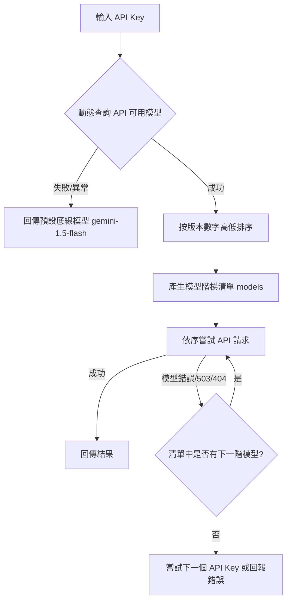

# Gemini API 動態模型路由與故障自癒降級移植指南

本指南旨在幫助您快速將 SlideAgent 中的 **「動態模型解析」**、**「漸進式版本降級重試（Gradual Fallback）」** 以及 **「金鑰健康並行探針」** 邏輯，移植到您其他使用相同 Gemini API 機制的專案中。

---

## 核心重構策略（三大核心）



---

## 步驟一：定義全域底線模型與快取
在您的設定檔或模組頂部，宣告快取對象與底線模型，以避免每次 API 呼叫都發送重複的網路請求：

```javascript
// 快取金鑰對應的模型清單：apiKey -> ['gemini-3.5-flash', 'gemini-2.5-flash', ...]
const modelCache = new Map();

// 當完全無法取得模型清單時的最後保險版本
const FALLBACK_MODEL = 'gemini-1.5-flash';
```

---

## 步驟二：實作模型動態解析與版本降冪排序
將此函式複製到您的 AI 處理模組中。它會動態向 Google 查詢可用模型，並依據版本數字（例如 `3.5` > `2.5` > `2.0` > `1.5`）進行降冪排序，確保最新的模型排在清單最前方：

```javascript
/**
 * 解析特定 API Key 可用的所有 Flash 模型，並按版本從新到舊排序
 * @param {string} apiKey - Gemini API Key
 * @param {boolean} throwOnError - 是否在網路錯誤時直接拋出異常（用於儲存驗證）
 * @returns {Promise<string[]>} 排序後的模型名稱陣列
 */
async function resolveFlashModelsList(apiKey, throwOnError = false) {
  if (!apiKey) {
    return [FALLBACK_MODEL];
  }
  
  if (modelCache.has(apiKey)) {
    return modelCache.get(apiKey);
  }

  try {
    const response = await fetch(`https://generativelanguage.googleapis.com/v1beta/models?key=${apiKey}`);
    if (!response.ok) {
      throw new Error(`Failed to fetch models: ${response.status}`);
    }
    const data = await response.json();
    if (!data.models || !Array.isArray(data.models)) {
      throw new Error('Invalid response format');
    }

    // 1. 過濾：只保留包含 'flash' 且支援 'generateContent' 的正式模型，排除預覽版 (preview, lite)
    const flashModels = data.models.filter(m => {
      const name = m.name || '';
      const nameLower = name.toLowerCase();
      const hasGenerateContent = m.supportedGenerationMethods && m.supportedGenerationMethods.includes('generateContent');
      return hasGenerateContent && 
             nameLower.includes('flash') && 
             !nameLower.includes('preview') && 
             !nameLower.includes('lite');
    });

    if (flashModels.length === 0) {
      return [FALLBACK_MODEL];
    }

    // 2. 解析版本號：提取 'gemini-X.Y-flash' 中的 X.Y 數字
    const parsedModels = flashModels.map(m => {
      const parts = m.name.split('/');
      const suffix = parts[parts.length - 1];
      const versionMatch = suffix.match(/gemini-(\d+\.?\d*)-flash/i);
      const versionNum = versionMatch ? parseFloat(versionMatch[1]) : 0;
      
      return { suffix, versionNum };
    });

    // 3. 版本號由高到低排序 (降冪)
    parsedModels.sort((a, b) => {
      if (b.versionNum !== a.versionNum) {
        return b.versionNum - a.versionNum;
      }
      return b.suffix.localeCompare(a.suffix, undefined, { numeric: true, sensitivity: 'base' });
    });

    const list = parsedModels.map(m => m.suffix).filter(m => m);
    
    // 確保極穩定的底線模型存在於清單中
    if (!list.includes(FALLBACK_MODEL)) {
      list.push(FALLBACK_MODEL);
    }

    console.log("Resolved Flash models order:", list);
    modelCache.set(apiKey, list);
    return list;
  } catch (e) {
    console.warn("Failed to resolve flash models list, using fallback:", e);
    if (throwOnError) throw e;
    return [FALLBACK_MODEL];
  }
}

/**
 * 取得最新的一款可用 Flash 模型（保留向後相容性用）
 */
async function resolveLatestFlashModel(apiKey, throwOnError = false) {
  try {
    const list = await resolveFlashModelsList(apiKey, throwOnError);
    return list[0] || FALLBACK_MODEL;
  } catch (e) {
    if (throwOnError) throw e;
    return FALLBACK_MODEL;
  }
}
```

---

## 步驟三：實作「雙層循環」自癒降級呼叫 (重試機制)
修改您專案中實際調用 `fetch` 發送 API 請求的邏輯。將單次呼叫包裝在 **「金鑰循環」** 與 **「模型階梯循環」** 的雙層結構中：

```javascript
async function callGeminiAPI(apiKeys, payload) {
  let lastError;

  // 第一層：輪詢所有金鑰
  for (const apiKey of apiKeys) {
    // 取得該金鑰適用的模型階梯（例如：['gemini-3.5-flash', 'gemini-2.5-flash', 'gemini-1.5-flash']）
    const models = await resolveFlashModelsList(apiKey);
    let lastModelError = null;

    // 第二層：依序嘗試版本由新到舊的模型
    for (const model of models) {
      try {
        console.log(`Trying API Key (...${apiKey.slice(-4)}) with Model: ${model}`);
        
        const response = await fetch(`https://generativelanguage.googleapis.com/v1beta/models/${model}:generateContent?key=${apiKey}`, {
          method: 'POST',
          headers: { 'Content-Type': 'application/json' },
          body: JSON.stringify(payload)
        });

        // 處理 HTTP 異常
        if (!response.ok) {
          const errData = await response.json().catch(() => ({}));
          const errorMsg = errData.error?.message || response.statusText;

          // 核心容錯邏輯：
          // - 400 (金鑰無效) 或 429 (額度耗盡) 屬於「金鑰錯誤」，應直接跳出模型循環，改用下一個金鑰。
          // - 503 (服務不可用) 或 404 (找不到模型) 屬於「模型錯誤」，應繼續循環嘗試下一款模型。
          if (response.status === 400 && (errorMsg.includes('API key') || errorMsg.includes('key not valid'))) {
            throw new Error(`INVALID_KEY: ${errorMsg}`);
          }
          if (response.status === 429) {
            throw new Error(`QUOTA_EXCEEDED: ${errorMsg}`);
          }
          throw new Error(`MODEL_ERROR: ${errorMsg}`);
        }

        const responseData = await response.json();
        
        // 請求成功！直接回傳結果，中斷所有循環
        return responseData;

      } catch (e) {
        lastModelError = e;
        console.warn(`Model ${model} failed: ${e.message}`);

        // 金鑰出錯，直接中斷模型循環，以便換下一個 API Key 嘗試
        if (e.message.startsWith('INVALID_KEY') || e.message.startsWith('QUOTA_EXCEEDED')) {
          break; 
        }
        
        // 如果是模型錯誤（503 等），則會執行下一次 model 循環，自動嘗試下一階模型
      }
    }

    // 記錄當前金鑰的最後一次錯誤
    lastError = lastModelError;
    
    // 如果是因為金鑰額度用完或失效，繼續嘗試下一組金鑰
    if (lastError && (lastError.message.startsWith('INVALID_KEY') || lastError.message.startsWith('QUOTA_EXCEEDED'))) {
      continue;
    }
  }

  // 若所有金鑰與模型全部嘗試失敗，拋出最終異常
  const finalError = lastError?.message || 'Unknown Error';
  throw new Error(`All attempts failed. Last error: ${finalError}`);
}
```

---

## 步驟四：實作儲存前的「健康探針並行過濾」 (防呆)
當使用者在 UI 設定介面輸入金鑰時，建議在儲存前先利用 `Promise.allSettled` 進行並行健康檢測，將有問題的金鑰直接剔除：

```javascript
async function handleSaveKeys(inputKeysText) {
  // 分割多行輸入
  const keys = inputKeysText.split('\n').map(k => k.trim()).filter(k => k);

  if (keys.length === 0) {
    saveToStorage(''); // 清空
    return;
  }

  try {
    // 建立並行探針 Promises
    const validationPromises = keys.map(async (key) => {
      // 藉由嘗試動態查詢模型清單，作為健康指標。
      // 若該 Key 無效或額度耗盡，此請求會拋出異常。
      await resolveLatestFlashModel(key, true);
      return key;
    });

    const results = await Promise.allSettled(validationPromises);
    
    // 篩選出通過驗證的 Key 陣列
    const validKeys = results
      .filter(r => r.status === 'fulfilled')
      .map(r => r.value);

    if (validKeys.length === 0) {
      alert('所有輸入的金鑰均無效或已耗盡額度！儲存已被攔截。');
      return;
    }

    // 儲存乾淨有效的金鑰清單
    saveToStorage(validKeys.join('\n'));
    
    const invalidCount = keys.length - validKeys.length;
    if (invalidCount > 0) {
      alert(`已成功儲存 ${validKeys.length} 組有效金鑰，自動排除 ${invalidCount} 組失效/額度耗盡的金鑰！`);
    } else {
      alert('金鑰全部驗證通過並儲存完成！');
    }
  } catch (err) {
    console.error("Validation error:", err);
    alert('驗證過程中發生錯誤，請稍後再試。');
  }
}
```

---

## 💡 移植後的預期優勢

* **零維護成本**：不需要在程式碼中寫死 `'gemini-3.0-flash'` 或 `'gemini-2.5-flash'`。當 Google 未來發布更新的模型時，只要該金鑰可用，系統就會**自動升級並優先選用**。
* **最大可用性**：當有新型號發布但因為地區、金鑰等級、或伺服器超載 (503) 暫時無法使用時，系統會**平穩、安全地退回使用次高版本**，直到最穩定的 1.5 版。
* **金鑰健康把關**：使用者在介面上不會因為誤輸入錯誤或過期的 Key 而導致系統後續拋出莫名的異常，保證了程式運作的乾淨度。
